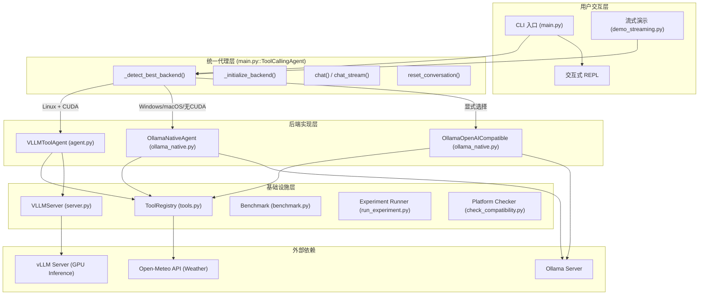
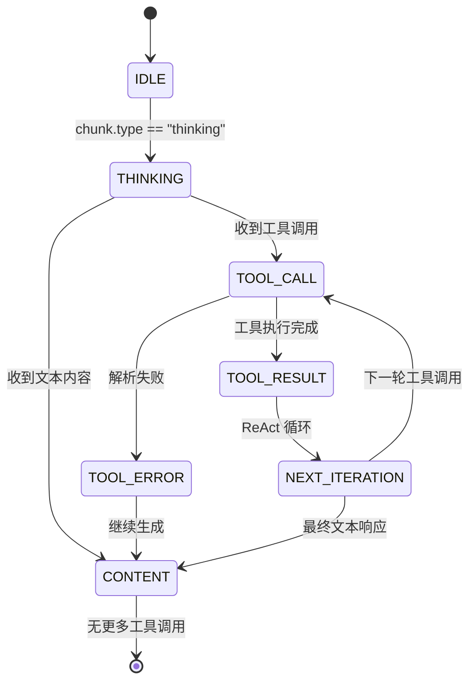

# local_llm_serving 项目深度分析

## 1. 项目概述

**来源**: 书籍 "AI Agents in Depth" Chapter 2 — Experiment 2-1

**目标**: 在本地运行小语言模型（Qwen3-0.6B），使其具备**工具调用（Tool Calling）**能力，演示 ReAct 代理的核心模式。

**支持后端**:
- **vLLM**: Linux + NVIDIA GPU（高性能 GPU 推理）
- **Ollama**: macOS / Windows / 无 CUDA 的 Linux（通用回退）

**核心模型**: `Qwen/Qwen3-0.6B` (默认，可通过 `.env` 配置)

---

## 2. 系统架构图

### 2.1 整体架构



### 2.2 ReAct 循环流程图

```mermaid
sequenceDiagram
    participant U as User
    participant A as Agent
    participant M as LLM (vLLM/Ollama)
    participant T as ToolRegistry

    U->>A: message: "温哥华现在几点?"
    A->>A: 构建系统提示词 + 工具 Schema
    A->>M: chat.completions.create(messages, tools)
    M-->>A: response: tool_calls=[time, weather]
    
    Note over A,M: 迭代 1: 工具调用
    A->>A: 并行执行工具调用 (ThreadPoolExecutor)
    A->>T: execute_tool("get_current_time", {"timezone":"..."})
    A->>T: execute_tool("get_current_temperature", {"location":"..."})
    T-->>A: 工具结果 (time, weather)
    A->>A: 将工具结果写入对话历史
    A->>M: 发送含工具结果的再次请求
    M-->>A: response: "温哥华当前时间..."

    Note over A,M: 迭代 2: 无工具调用 -> 终止
    A->>A: 记录最终响应
    A-->>U: "温哥华当前时间为 2026-07-30..."
```### 2.3 数据流与依赖关系

```mermaid
graph LR
    subgraph "核心依赖图"
        main["main.py"] --> config["config.py"]
        main --> server["server.py"]
        main --> agent["agent.py"]
        main --> ollama["ollama_native.py"]
        agent --> tools["tools.py"]
        ollama --> tools
        server --> config
        runexp["run_experiment.py"] --> tools
        benchmark["benchmark.py"] -.->|"OpenAI-compatible API"| main
    end

    subgraph "测试文件"
        test1["test_parallel_tools.py"] --> agent
        test1 --> ollama
        test2["test_vllm_structured_streaming.py"] --> agent
        test3["test_ollama_thinking.py"] --> ollama
        test4["test_platform_detection.py"] --> main
        test5["test_benchmark.py"] --> benchmark
        test6["test_run_experiment.py"] --> runexp
        test7["test_code_interpreter_full.py"] --> tools
    end
```

### 2.4 流式输出 Chunk 类型协议



---

## 3. 文件逐文件分析

### 3.1 `main.py` — 统一入口与代理编排

**文件位置**: `chapter2/local_llm_serving/main.py`

**行数**: 659 行

**功能描述**: 作为整个项目的统一入口点，`main.py` 封装了两个后端（vLLM 和 Ollama）的差异，提供平台自动检测和统一 API。它支持两种运行模式：交互式 REPL 和单任务执行，并支持流式输出。

**核心类**:

#### `class ToolCallingAgent`

| 方法 | 签名 | 返回值 | 描述 |
|---|---|---|---|
| `__init__` | `(self, backend: Optional[str] = None)` | `None` | 初始化代理，自动检测或强制指定后端 |
| `_detect_best_backend` | `(self) -> str` | `str` | 根据平台和 CUDA 可用性选择最佳后端 |
| `_initialize_backend` | `(self) -> None` | `None` | 根据 `backend_type` 初始化对应后端 |
| `_init_vllm` | `(self) -> None` | `None` | 初始化 vLLM 后端（检查/启动服务器，创建 VLLMToolAgent） |
| `_init_ollama` | `(self) -> None` | `None` | 初始化 Ollama 后端（检查运行状态，创建 OllamaNativeAgent） |
| `chat` | `(self, message: str, use_tools: bool = True, stream: bool = False, **kwargs) -> str \| Generator` | `str` 或 Generator | 向代理发送消息，返回最终文本或流式 chunk 生成器 |
| `reset_conversation` | `(self) -> None` | `None` | 重置对话历史 |

**独立函数**:

| 函数 | 签名 | 描述 |
|---|---|---|
| `get_sample_tasks` | `() -> List[Dict[str, str]]` | 返回 7 个预定义的演示任务，涵盖时间查询、天气、金融计算、时区协调等 |
| `run_single_task` | `(agent: ToolCallingAgent, task: str, stream: bool = True) -> None` | 执行单个任务，支持流式和非流式输出，按 chunk 类型分发事件 |
| `interactive_mode` | `(agent: ToolCallingAgent, stream: bool = True) -> None` | 交互式 REPL 模式，支持 /reset, /tools, /stream, /sample, /help, /exit 等命令 |
| `main` | `() -> int` | CLI 入口函数，解析 `argparse` 参数，支持 `--mode`, `--task`, `--backend`, `--info`, `--stream/--no-stream` |

**关键特性**:
- **平台检测逻辑**: Linux + CUDA → vLLM；Windows（即使有 CUDA）→ Ollama（因 vLLM 不支持原生 Windows）；macOS/Linux 无 CUDA → Ollama
- **vLLM 自动启动**: 若 vLLM 服务器未运行，`_init_vllm()` 自动通过 `VLLMServer` 启动
- **流式 chunk 协议**: 统一输出 `thinking`、`tool_call`、`tool_result`、`content`、`error` 五种 chunk 类型### 3.2 `agent.py` — vLLM 工具调用代理

**文件位置**: `chapter2/local_llm_serving/agent.py`

**行数**: 591 行

**功能描述**: 基于 vLLM 的 OpenAI 兼容 API 实现完整的 ReAct 代理。使用 Qwen3 模型的 XML 格式工具调用协议（`<tool_call></tool_call>` 标签），支持非流式和流式两种模式，处理了流式模式下工具调用参数分片到达的特殊情况。

**核心类**:

#### `class VLLMToolAgent`

| 方法 | 签名 | 返回值 | 描述 |
|---|---|---|---|
| `__init__` | `(self, api_base: str = OPENAI_API_BASE, api_key: str = OPENAI_API_KEY) -> None` | `None` | 初始化 OpenAI 客户端和工具注册表 |
| `_format_system_prompt_with_tools` | `(self) -> str` | `str` | 构建包含 `<tools>` XML 标签的 Qwen3 格式系统提示词 |
| `_parse_tool_calls` | `(self, content: str) -> List[Dict[str, Any]]` | `List[Dict]` | 用正则解析 `<tool_call></tool_call>` 标签中的 JSON 工具调用 |
| `_execute_tool_calls` | `(self, tool_calls: List[Dict[str, Any]]) -> List[Dict[str, Any]]` | `List[Dict]` | 并行执行工具调用（`ThreadPoolExecutor`），返回格式化结果 |
| `_execute_single_tool` | `(self, tool_data: Dict[str, Any]) -> Tuple[str, bool]` | `Tuple[str, bool]` | 执行单个工具调用，返回 `(结果文本, 是否错误)` |
| `chat` | `(self, message: str, use_tools: bool = True, temperature: float = 0.3, max_tokens: int = 2048, stream: bool = False) -> str \| Generator` | `str` 或 Generator | ReAct 主循环，非流式或流式调用，最多 10 轮迭代 |
| `chat_stream` | `(self, message: str, use_tools: bool = True, temperature: float = 0.3, max_tokens: int = 2048) -> Generator` | `Generator` | 流式 ReAct 循环，按索引分片重组工具调用参数，Yield 多种 chunk 类型 |
| `reset_conversation` | `(self) -> None` | `None` | 清空对话历史 |
| `get_conversation_history` | `(self) -> List[Dict[str, Any]]` | `List[Dict]` | 获取当前对话历史 |
| `add_custom_tool` | `(self, name: str, function: callable, description: str, parameters: Dict) -> None` | `None` | 注册自定义工具到工具注册表 |

**关键细节**:
- **结构化工具调用解析**: vLLM 在 `enable_auto_tool_choice` + `hermes` 解析器模式下，将 `<tool_call></tool_call>` 标签中的内容提取到 `response.choices[0].message.tool_calls` 结构化字段，而非留在 `content` 中
- **分片重组**: `chat_stream()` 通过 `tool_call_parts` 字典按 `fragment.index` 分片缓冲 `id`、`name`、`arguments`，在流结束后按索引排序重组
- **错误处理**: 工具参数解析失败时 yield `tool_error` chunk 并记录到对话历史，但不中断循环
- **对话历史格式**: 工具结果以 `<tool_response>\n{content}\n?-->` 格式写入，role 为 `"user"`（Qwen3 特殊处理）### 3.3 `ollama_native.py` — Ollama 代理实现

**文件位置**: `chapter2/local_llm_serving/ollama_native.py`

**行数**: 628 行

**功能描述**: 提供两种 Ollama 连接方式：原生 API 和 OpenAI 兼容端点。原生 API 支持 Ollama 的 `think=True` 推理模式（带自动降级）。OpenAI 兼容端点提供更标准的工具调用接口。

**核心类 1: `OllamaNativeAgent`**

| 方法 | 签名 | 返回值 | 描述 |
|---|---|---|---|
| `__init__` | `(self, model: str = "qwen3:0.6b") -> None` | `None` | 初始化 Ollama 原生客户端，检查连接，初始化工具注册表 |
| `_convert_tools_to_ollama_format` | `(self) -> List[Dict]` | `List[Dict]` | 将工具注册表转换为 Ollama 期望的格式 |
| `_chat_with_think_fallback` | `(self, **kwargs) -> dict` | `dict` | 尝试 `think=True`，若 400 错误则缓存禁用并回退重试 |
| `_execute_tool_calls` | `(self, tool_calls: List[Dict[str, Any]]) -> List[str]` | `List[str]` | 并行执行工具调用，返回结果字符串列表 |
| `chat` | `(self, message: str, use_tools: bool = True, temperature: float = 0.3, stream: bool = False) -> str` | `str` | 非流式 ReAct 循环，支持 `think=True` |
| `chat_stream` | `(self, message: str, use_tools: bool = True, temperature: float = 0.3) -> Generator` | `Generator` | 流式 ReAct 循环，处理 `thinking` 字段，Yield 多种 chunk 类型 |
| `reset_conversation` | `(self) -> None` | `None` | 重置对话历史 |

**核心类 2: `OllamaOpenAICompatible`**

| 方法 | 签名 | 返回值 | 描述 |
|---|---|---|---|
| `__init__` | `(self, model: str = "qwen3:0.6b", base_url: str = "http://localhost:11434/v1") -> None` | `None` | 初始化 OpenAI 兼容客户端连接 Ollama |
| `chat` | `(self, message: str, use_tools: bool = True, temperature: float = 0.3) -> str` | `str` | 通过 OpenAI 兼容端点的非流式工具调用 |
| `reset_conversation` | `(self) -> None` | `None` | 重置对话历史 |

**辅助函数**:
- `test_native_tools()`: 测试入口，检查已安装的模型并执行工具调用测试
- `demo()`: 交互式演示，让用户选择原生 API 或 OpenAI 兼容端点

**关键细节**:
- **Think 降级机制**: `_chat_with_think_fallback()` 使用 `_think_disabled: set[str]` 缓存不支持思考的模型，避免重复失败调用
- **流式去重**: `chat_stream()` 通过比较 `name` 和 `arguments` 去重 Ollama 在每次 chunk 中累积的 `tool_calls` 列表
- **对话历史格式差异**: Ollama 原生 API 使用 `role: "tool"`，而 OpenAI 兼容端点使用 `role: "tool"` + `tool_call_id`### 3.4 `tools.py` — 工具注册表与实现

**文件位置**: `chapter2/local_llm_serving/tools.py`

**行数**: 502 行

**功能描述**: 提供工具注册表管理和 5 个内置工具实现。所有代理均使用同一个 `ToolRegistry` 实例，确保工具行为一致。

**核心类**:

#### `class ToolRegistry`

| 方法 | 签名 | 返回值 | 描述 |
|---|---|---|---|
| `__init__` | `(self) -> None` | `None` | 初始化空注册表并自动注册 4 个默认工具 |
| `register_tool` | `(self, name: str, function: callable, description: str, parameters: Dict) -> None` | `None` | 注册一个新工具到内部 `self.tools` 字典 |
| `get_tool_schemas` | `(self) -> List[Dict]` | `List[Dict]` | 返回 OpenAI 兼容格式的函数调用工具 Schema 列表 |
| `execute_tool` | `(self, name: str, arguments: Dict[str, Any]) -> str` | `str` | 按名称查找工具并执行，返回 JSON 序列化字符串 |

**内置工具实现（均为 `@staticmethod`）**:

| 工具名 | 方法签名 | 描述 | 依赖 |
|---|---|---|---|
| `get_current_temperature` | `(location: str, unit: str = "celsius") -> Dict` | 通过 Open-Meteo Geocoding + Weather API 获取实时天气数据，失败时回退到模拟数据 | `requests`, `datetime`, `random` |
| `get_current_time` | `(timezone: str = "UTC") -> Dict` | 使用 `zoneinfo` 进行时区转换，支持 20+ 个缩写别名（EST, PST, JST 等） | `datetime`, `zoneinfo` |
| `convert_currency` | `(amount: float, from_currency: str, to_currency: str) -> Dict` | 基于 12 种主要货币的模拟汇率表进行换算（USD→目标货币→USD 中转） | `datetime` |
| `parse_pdf` | `(url: str) -> Dict` | 支持 URL 和本地文件路径的 PDF 解析，返回前 5 页文本 | `requests`, `PyPDF2`, `io` |
| `code_interpreter` | `(code: str) -> Dict` | 在完整 Python 命名空间中执行代码，捕获 stdout/stderr，检测 `result`/`total`/`sum` 等变量名 | `re`, `math`, `random`, `datetime`, `sys` |

**独立函数**:
- `format_tool_response(tool_name: str, tool_result: str) -> Dict`: 将工具结果格式化为 `{"role": "tool", "name": ..., "content": ...}` 字典

**关键设计决策**:
- `code_interpreter` **故意不做 `^` → `**` 替换**: 因为 `^` 在 Python 中是合法的二进制异或运算符，替换会静默改变代码语义
- `get_current_temperature` 失败时回退到 `random` 生成的模拟数据，确保工具调用不会因网络问题完全失败
- `execute_tool` 将所有结果 JSON 序列化后返回字符串，代理端通过 `json.loads()` 解析判断成功/失败### 3.5 `server.py` — vLLM 服务器管理器

**文件位置**: `chapter2/local_llm_serving/server.py`

**行数**: 245 行

**功能描述**: 管理 vLLM 推理服务器的完整生命周期（启动、停止、健康检查、重启），并处理命令行参数和模型下载。

**核心类**:

#### `class VLLMServer`

| 方法 | 签名 | 返回值 | 描述 |
|---|---|---|---|
| `__init__` | `(self, config: dict = None) -> None` | `None` | 初始化服务器配置（默认使用 `VLLM_SERVER_CONFIG`），设置 `server_url` |
| `_build_command` | `(self) -> list` | `list[str]` | 构建 vLLM 启动命令，包含 `--enable-auto-tool-choice --tool-call-parser hermes` 等工具相关参数 |
| `start` | `(self, wait_for_ready: bool = True, timeout: int = 120) -> None` | `None` | 使用 `subprocess.Popen` 启动 vLLM 进程，日志写入 `logs/vllm_server.log`，可选等待就绪 |
| `_wait_for_ready` | `(self, timeout: int = 120) -> None` | `None` | 轮询 `/health` 端点直到就绪或超时；进程死亡时抛出 `RuntimeError` |
| `stop` | `(self) -> None` | `None` | 先 `terminate()` 等待 10 秒，超时则 `kill()`，等待子进程退出 |
| `is_running` | `(self) -> bool` | `bool` | 检查进程存活且 `/health` 返回 200 |
| `restart` | `(self) -> None` | `None` | 先停止再启动（中间 sleep 2 秒） |

**独立函数**:
- `download_model_from_modelscope() -> Optional[str]`: 通过 ModelScope 下载模型（可选的国内镜像）
- `main() -> None`: CLI 入口，支持 `--download`, `--model`, `--port`, `--host` 参数，启动后持续运行直到 Ctrl+C

**构建的 vLLM 启动命令参数**:
```
python -m vllm.entrypoints.openai.api_server \
  --model Qwen/Qwen3-0.6B \
  --port 8000 --host localhost \
  --enable-auto-tool-choice \
  --tool-call-parser hermes \
  --max-model-len 8192 \
  --gpu-memory-utilization 0.9 \
  --dtype auto
```

### 3.6 `config.py` — 集中配置

**文件位置**: `chapter2/local_llm_serving/config.py`

**行数**: 41 行

**功能描述**: 加载 `.env` 文件中的环境变量，定义所有可配置的常量和 vLLM 服务器配置字典。

**导出常量**:

| 常量名 | 类型 | 默认值 | 说明 |
|---|---|---|---|
| `MODEL_NAME` | `str` | `"Qwen/Qwen3-0.6B"` | vLLM 加载的模型名或本地路径 |
| `MODEL_PATH` | `str \| None` | `None` | 可选的本地模型路径 |
| `VLLM_PORT` | `int` | `8000` | vLLM 服务器端口 |
| `VLLM_HOST` | `str` | `"localhost"` | vLLM 服务器主机 |
| `VLLM_SERVER_CONFIG` | `dict` | 见下表 | vLLM 服务器完整配置 |
| `OPENAI_API_BASE` | `str` | `"http://localhost:8000/v1"` | OpenAI 兼容 API 端点 |
| `OPENAI_API_KEY` | `str` | `"EMPTY"` | API Key（vLLM 不需要真实值） |
| `LOG_LEVEL` | `str` | `"INFO"` | 日志级别 |

**`VLLM_SERVER_CONFIG` 字典结构**:
```python
{
    "model": "Qwen/Qwen3-0.6B",
    "port": 8000,
    "host": "localhost",
    "enable_auto_tool_choice": True,
    "tool_call_parser": "hermes",
    "max_model_len": 8192,
    "gpu_memory_utilization": 0.9,
    "dtype": "auto",
    "enforce_eager": False,
}
```

**被哪些文件引用**: `server.py`, `agent.py`, `main.py`### 3.7 `benchmark.py` — 服务性能基准测试

**文件位置**: `chapter2/local_llm_serving/benchmark.py`

**行数**: 487 行

**功能描述**: 测量本地 LLM 推理服务在三个维度上的性能指标：单流吞吐量/TTFT、KV Cache 命中/未命中对比、批处理并发吞吐。与书籍 Experiment 2-1 配套，帮助读者建立对 serving 层优化的直觉。

**核心函数**:

| 函数 | 签名 | 返回值 | 描述 |
|---|---|---|---|
| `build_padded_system_prompt` | `(target_tokens: int) -> str` | `str` | 构造约 `target_tokens` 个 token 的确定性长系统提示词（用于 KV Cache 测试） |
| `make_client` | `(base_url: str, api_key: str) -> OpenAI` | `OpenAI` | OpenAI 兼容客户端工厂 |
| `stream_once` | `(client, model, messages, max_tokens, temperature) -> Dict[str, float]` | `Dict` | 发起单次流式请求，返回 `ttft`, `total`, `output_tokens`, `decode_tps` |
| `scenario_throughput` | `(client, model, args) -> Dict[str, Any]` | `Dict` | 单流吞吐场景：连续 `repeats` 次解码密集请求，计算平均 TTFT 和解码 TPS |
| `scenario_kv_cache` | `(client, model, args) -> Dict[str, Any]` | `Dict` | KV Cache 场景：相同前缀 vs 开头修改的 TTFT 对比，报告加速比 |
| `scenario_batching` | `(client, model, args) -> Dict[str, Any]` | `Dict` | 批处理场景：并发度 1/2/4/8... 扫描，报告聚合 TPS 和单请求 TPS |
| `print_report` | `(results: List[Dict[str, Any]]) -> None` | `None` | 格式化打印测试结果表格 |
| `describe_dry_run` | `(args) -> None` | `None` | 离线打印计划，不访问服务端 |
| `build_parser` | `() -> argparse.ArgumentParser` | `ArgumentParser` | 构建 CLI 参数解析器 |
| `main` | `() -> int` | `int` | 主入口，解析参数，运行场景，输出报告 |

**CLI 参数**:

| 参数 | 类型 | 默认值 | 描述 |
|---|---|---|---|
| `--scenario` | `str` | `"all"` | 场景: `throughput`, `kv-cache`, `batching`, `all` |
| `--backend` | `str` | `"vllm"` | 后端类型: `vllm` 或 `ollama` |
| `--base-url` | `str` | 根据后端自动 | OpenAI 兼容接口地址 |
| `--model` | `str` | 根据后端自动 | 模型名 |
| `--repeats` | `int` | `5` | 重复次数 |
| `--max-tokens` | `int` | `256` | 最大生成 token 数 |
| `--temperature` | `float` | `0.7` | 采样温度 |
| `--prefix-tokens` | `int` | `1024` | KV Cache 前缀近似 token 数 |
| `--concurrency` | `List[int]` | `[1,2,4,8]` | 并发度列表 |
| `--output` | `str` | 无 | JSON 结果输出路径 |
| `--dry-run` | `bool` | `False` | 离线打印计划 |

**KV Cache 测试原理**:
- **命中组**: 逐字节不变的相同请求，服务端前缀缓存命中 → TTFT 极低
- **未命中组**: 每次只在系统提示词开头插入唯一标记（如 `[req-0-1234567890]`），使缓存完全失效 → TTFT 显著升高
- 两组的提示词长度基本一致，差异仅来自前缀缓存是否命中### 3.8 `run_experiment.py` — 完整实验运行器

**文件位置**: `chapter2/local_llm_serving/run_experiment.py`

**行数**: 447 行

**功能描述**: 运行完整的 Experiment 2-1 验收流程。不同于 OpenAI 兼容客户端，此运行器刻意使用 Ollama 的 `/api/generate` 端点（`raw=true`），保留模型原始输出中的所有特殊标记和工具调用协议。产生可审计的证据（`evidence.json`）和清单（`manifest.json`）。

**核心类**:

#### `class OllamaRawClient`

| 方法 | 签名 | 返回值 | 描述 |
|---|---|---|---|
| `__init__` | `(self, base_url: str, model: str, timeout: float = 180.0) -> None` | `None` | 初始化，设置 base_url 和超时 |
| `get_json` | `(self, path: str) -> dict[str, Any]` | `dict` | 发送 GET 请求并返回 JSON |
| `show_model` | `(self) -> dict[str, Any]` | `dict` | 调用 `/api/show` 获取模型元数据 |
| `generate` | `(self, prompt: str, *, num_predict: int, temperature: float) -> dict[str, Any]` | `dict` | 流式发送 `/api/generate` 请求（`raw=True`），保留所有 chunk，计算 TTFT、服务端 token 计数/耗时、响应 SHA256 |

**独立函数**:

| 函数 | 签名 | 返回值 | 描述 |
|---|---|---|---|
| `parse_tool_calls` | `(raw_text: str) -> list[dict[str, Any]]` | `list[dict]` | 用正则 `<tool_call>\s*(\{.*?\})\s*</tool_call>` 解析原始输出中的 JSON 工具调用 |
| `normalize_tool_call` | `(call: dict[str, Any]) -> dict[str, Any]` | `dict` | 小模型容错：将 `city` 参数映射为 `timezone`/`location`，兼容 `get_weather` → `get_current_temperature` |
| `execute_parallel` | `(registry: ToolRegistry, calls: list[dict[str, Any]]) -> dict[str, Any]` | `dict` | 并行执行工具调用，返回每调用的索引、名称、参数、结果、耗时 |
| `render_prompt` | `(tokenizer, messages, tools=None) -> str` | `str` | 使用 `AutoTokenizer.apply_chat_template` 渲染提示词 |
| `run_tool_case` | `(client, tokenizer, protocol) -> dict[str, Any]` | `dict` | 运行工具调用测试用例：渲染提示词 → 模型首次调用 → 解析/归一化工具调用 → 并行执行 → 反馈结果 → 模型终止 |
| `run_cache_case` | `(client, tokenizer, protocol) -> dict[str, Any]` | `dict` | 运行 KV Cache 测试用例：~4096 token 前缀 + 2 次预热 + 5 对匹配 hit/miss |
| `credential_scan` | `(path: Path) -> list[str]` | `list[str]` | 扫描 `evidence.json` 中的 API 密钥模式（`sk-...`, `sk-or-...`） |
| `main` | `() -> int` | `int` | 主入口：加载协议 → 创建客户端 → 运行 tool_case + cache_case → 写 evidence.json + manifest.json → 返回 0/1 |

**CLI 参数**:

| 参数 | 默认值 | 描述 |
|---|---|---|
| `--base-url` | `http://localhost:11434` | Ollama 端点 |
| `--model` | `qwen3:0.6b` | 模型名 |
| `--tokenizer` | `Qwen/Qwen3-0.6B` | Tokenizer 路径 |
| `--output` | 必填 | 输出目录路径 |

**输出文件**:
- `experiment_protocol.json` — 冻结实验协议的副本
- `evidence.json` — 完整可审计证据（原始请求/响应、SHA256 哈希、服务端 token 计数、耗时、工具调用详情、通过/失败门控）
- `manifest.json` — 运行收据（`official_complete`: true/false, `credential_scan_passed`, `cost`: $0）

**验收门控 (acceptance_gates)**:
1. 服务端报告 `qwen3:0.6b` 且有非空不可变模型摘要
2. 渲染的提示词保留 chat template 特殊标记和工具 Schema
3. 首次原始响应包含且仅包含两个必需的工具调用
4. 两个工具并行执行并返回可审计结果
5. 第二次模型调用消费两个工具结果并终止（不再工具调用）
6. 流 chunk、请求提示词、计时、token 计数、服务端耗时和哈希均被保留
7. 匹配的 hit/miss TTFT 样本被保留
8. 所有执行均为本地（除只读的 Open-Meteo 天气查询）
9. 无凭证被发送或保留到实验中### 3.9 `check_compatibility.py` — 系统兼容性检查

**文件位置**: `chapter2/local_llm_serving/check_compatibility.py`

**行数**: 153 行

**功能描述**: CLI 工具，检查操作系统、GPU、CUDA、PyTorch 可用性，并基于平台给出相应的安装和运行建议。

**核心函数**:

| 函数 | 签名 | 返回值 | 描述 |
|---|---|---|---|
| `check_system` | `() -> tuple[bool, str]` | `(cuda_available: bool, system: str)` | 检查系统兼容性：OS、架构、Python 版本、NVIDIA GPU (`nvidia-smi`)、PyTorch CUDA |
| `provide_recommendations` | `(cuda_available: bool, system: str) -> None` | `None` | 基于检查结果打印平台特定的安装和运行步骤 |
| `main` | `() -> None` | `None` | CLI 入口 |

**平台检测逻辑**:
| 平台 | CUDA | 推荐后端 |
|---|---|---|
| Windows | 有/无 | Ollama（vLLM 不支持原生 Windows） |
| macOS (Darwin) | 无 | Ollama（使用 Homebrew 安装） |
| Linux | 有 | vLLM |
| Linux | 无 | Ollama |

### 3.10 `demo_streaming.py` — 流式演示脚本

**文件位置**: `chapter2/local_llm_serving/demo_streaming.py`

**行数**: 214 行

**功能描述**: 独立演示脚本，展示 vLLM 和 Ollama 后端的流式输出效果。

**核心函数**:

| 函数 | 签名 | 描述 |
|---|---|---|
| `demo_vllm_streaming` | `() -> None` | 使用 `VLLMToolAgent` 展示 vLLM 流式输出 |
| `demo_ollama_streaming` | `() -> None` | 使用 `OllamaNativeAgent` 展示 Ollama 流式输出 |
| `demo_unified_streaming` | `() -> None` | 使用 `ToolCallingAgent`（自动检测）展示统一流式输出 |
| `main` | `() -> None` | CLI 入口，`--backend {vllm, ollama, auto}` |

### 3.11 测试文件汇总

| 文件 | 行数 | 测试目标 |
|---|---|---|
| `test_benchmark.py` | 53 | 验证 `stream_once()` 正确使用 `reasoning_content`/`reasoning` chunk 测量 TTFT |
| `test_code_interpreter_full.py` | 184 | 全面测试 `code_interpreter` 工具：4 个成功场景、5 个错误类型、完整环境访问、代理错误传播 |
| `test_ollama_thinking.py` | 47 | 回归测试：Ollama 流式输出中 `thinking` 字段在 `content` 之前到达 |
| `test_parallel_tools.py` | 249 | E2E 测试：跨所有代理实现的并行工具执行 + 真实模型工具调用 |
| `test_platform_detection.py` | 60 | 平台检测单元测试：Windows+CUDA 仍用 Ollama、Linux+CUDA 用 vLLM 等 |
| `test_run_experiment.py` | 42 | 实验运行器单元测试：解析、归一化、协议有效性 |
| `test_streaming.py` | 173 | 流式 vs 非流式对比演示 |
| `test_vllm_structured_streaming.py` | 102 | vLLM 流式分片工具调用重组 + 参数解析错误的处理 |

### 3.12 配置与脚本文件

| 文件 | 描述 |
|---|---|
| `requirements.txt` | 22 行，定义所有 Python 依赖，`vllm` 有条件安装（仅 Linux） |
| `env.example` / `.env.example` | 环境变量模板：`MODEL_NAME`, `VLLM_HOST`, `VLLM_PORT`, `LOG_LEVEL` |
| `experiment_protocol.json` | 冻结的实验设计文档，包含运行时配置、工具用例、缓存用例、验收门控 |
| `setup.sh` | 92 行自动化环境设置脚本：Python 版本检查、GPU 检测、虚拟环境创建、依赖安装 |
| `runs/` | 实验运行输出目录，包含 `evidence.json`, `manifest.json`, 协议副本 |## 4. 接口参考文档

### 4.1 统一代理接口 (ToolCallingAgent)

这是用户与系统交互的最高层级 API：

```python
from main import ToolCallingAgent

# 自动检测后端
agent = ToolCallingAgent()

# 强制指定后端
agent = ToolCallingAgent(backend="vllm")
agent = ToolCallingAgent(backend="ollama")

# 发送消息（非流式）
response: str = agent.chat("温哥华现在几点了？")

# 发送消息（流式）
for chunk in agent.chat("温哥华现在几点了？", stream=True):
    print(chunk["type"], chunk["content"])

# 重置对话
agent.reset_conversation()
```

### 4.2 vLLM 代理接口 (VLLMToolAgent)

```python
from agent import VLLMToolAgent

agent = VLLMToolAgent(
    api_base="http://localhost:8000/v1",
    api_key="EMPTY"
)

# 非流式
response: str = agent.chat(
    message="获取东京当前时间和天气",
    use_tools=True,
    temperature=0.3,
    max_tokens=2048,
    stream=False
)

# 流式
for chunk in agent.chat_stream(
    message="获取东京当前时间和天气",
    use_tools=True,
    temperature=0.3,
    max_tokens=2048
):
    print(f"[{chunk['type']}] {chunk['content']}")

# 注册自定义工具
agent.add_custom_tool(
    name="my_tool",
    function=my_function,
    description="My custom tool",
    parameters={"type": "object", "properties": {...}}
)

# 获取对话历史
history = agent.get_conversation_history()
```

### 4.3 Ollama 代理接口

```python
from ollama_native import OllamaNativeAgent, OllamaOpenAICompatible

# 方式一：原生 API（支持 think=True）
agent = OllamaNativeAgent(model="qwen3:0.6b")
response: str = agent.chat("温哥华现在几点了？", use_tools=True, temperature=0.3)

# 流式
for chunk in agent.chat_stream("温哥华现在几点了？", use_tools=True, temperature=0.3):
    print(f"[{chunk['type']}] {chunk['content']}")

# 方式二：OpenAI 兼容端点
agent = OllamaOpenAICompatible(
    model="qwen3:0.6b",
    base_url="http://localhost:11434/v1"
)
response: str = agent.chat("温哥华现在几点了？", use_tools=True, temperature=0.3)
```

### 4.4 工具注册表接口 (ToolRegistry)

```python
from tools import ToolRegistry

registry = ToolRegistry()

# 获取工具 Schema（OpenAI 兼容格式）
schemas: List[Dict] = registry.get_tool_schemas()
# [
#   {"type": "function", "function": {"name": "get_current_temperature", ...}},
#   {"type": "function", "function": {"name": "get_current_time", ...}},
#   ...
# ]

# 执行工具
result: str = registry.execute_tool("get_current_temperature", {"location": "Vancouver", "unit": "celsius"})
# 返回 JSON 字符串

# 注册自定义工具
registry.register_tool(
    name="custom_tool",
    function=lambda x: {"result": x},
    description="A custom tool",
    parameters={"type": "object", "properties": {"x": {"type": "string"}}}
)
```

### 4.5 vLLM 服务器管理接口 (VLLMServer)

```python
from server import VLLMServer

server = VLLMServer()

# 启动（自动等待就绪）
server.start(wait_for_ready=True, timeout=120)

# 检查状态
running: bool = server.is_running()

# 停止
server.stop()

# 重启
server.restart()
```

### 4.6 系统兼容性检查接口

```python
from check_compatibility import check_system, provide_recommendations

# 检查系统
cuda_available, system = check_system()

# 获取建议
provide_recommendations(cuda_available, system)
```

### 4.7 流式输出 Chunk 类型规范

| type | content 字段 | 说明 |
|---|---|---|
| `"thinking"` | `str` | 模型的推理过程（Ollama 的 `thinking` 字段或 `<think>...</think>` 标签内容） |
| `"tool_call"` | `dict{"name": str, "arguments": dict}` | 工具调用请求 |
| `"tool_result"` | `str` | 工具执行结果 |
| `"tool_error"` | `str` | 工具调用解析或执行错误 |
| `"content"` | `str` | 最终文本响应内容 |
| `"error"` | `str` | 系统级错误（如最大迭代次数超限） |

---

## 5. 关键设计模式与决策

### 5.1 统一代理封装模式

`ToolCallingAgent` 通过 `_detect_best_backend()` 和 `_initialize_backend()` 将 vLLM 和 Ollama 的差异完全封装。调用方只需要使用统一的 `chat()` 方法，无需关心底层使用哪个后端。

### 5.2 并行工具执行

所有代理实现均使用 `ThreadPoolExecutor` 并行执行同一轮次中的多个工具调用。`test_parallel_tools.py` 通过确定性 2 秒 sleep 测试验证了并行性（assert `< 3.6s` 而非 `~4s`）。

### 5.3 ReAct 循环

所有代理实现包含一个最多 10 轮迭代的循环：
1. 向模型发送消息（含系统提示词 + 对话历史 + 工具 Schema）
2. 解析模型返回的工具调用
3. 并行执行所有工具调用
4. 将结果写回对话历史
5. 再次向模型发送请求（含工具结果）
6. 若模型不再请求工具调用，输出最终文本并终止

### 5.4 可审计的实验证据

`run_experiment.py` 实现了一套完整的实验审计机制：
- 使用 Ollama 原始 `/api/generate` 端点（`raw=True`）获取精确模型输出
- 计算所有输入/输出的 SHA256 哈希
- 保留服务端 token 计数和耗时
- 扫描证据文件中的 API 密钥泄露
- 使用冻结的 `experiment_protocol.json` 定义验收门控

### 5.5 平台感知后端选择

检测逻辑考虑了边界情况：**Windows + CUDA 仍使用 Ollama**，因为 vLLM 官方不支持原生 Windows（仅支持 Linux / WSL2）。